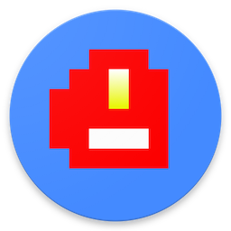

#  Bunsen Browser 

  An experimental P2P web browser for Android that uses [Dat](https://datproject.org) to download and share websites.

  If you have an Android device with an ARMv7 processor you can try it out. [Download the APK](https://drive.google.com/file/d/1GRlzMzjitL27tyahs2qfkm8QvZneWS_z/view?usp=sharing), install and launch, then visit dat://blog-rjsteinert.github.io/. 
  
  To load another dat, enter a new address or select a dat from the history, which is listed below the input box when you are typing in it.

Bunsen will open sites with links to dats (`a href=dat://`) too. In your device's browser, check out [hashbase.io](http://hashbase.io) for a list of sites and click the dat links to open them in Bunsen.

  View a walkthrough of this APK and any feedback [here](https://github.com/bunsenbrowser/bunsen/issues).

  Give it a try and let us know what you think!

  Want to help out? Check out the Bunsen Browser [issue queue](https://github.com/bunsenbrowser/bunsen/issues). There are plenty of goodies to help out with. The [wiki](https://github.com/bunsenbrowser/bunsen/wiki) provides background on device compatability, and there's also a [Roadmap](https://github.com/bunsenbrowser/bunsen/wiki/Roadmap).

